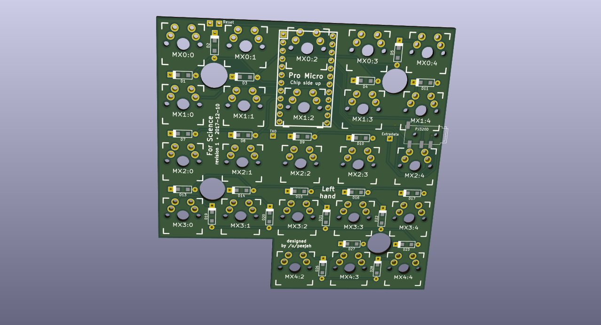

For Science is a 46 key ortholinear split keyboard PCB with a 3 key thumb cluster.

The goal of this project is to build a usable split keyboard with a PCB case within the 100x100mm cheap PCB size limit offered by some PCB manufactuers. Designed to be easy to build, it only supports serial communication over a TRRS cable and no LED support. The PCB is reversible, meaning that you need two of the same PCB to create a full keyboard.

# Bill of Materials (BOM)

* 2 PCBs
* 46 MX compatible switches.
* 46 1n4148 diodes.
* 2 Pro Micro controllers.
* 2 PJ320D 3.5mm TRRS jacks.
* TRRS cable and micro USB cable.
* 2 plate PCBs and 2 base PCBs.
* 8 M2 standoffs (15mm)
* 16 M2 screws (6mm)
* 46 MX compatible key caps.

# Ordering PCBs

PCBs can be manufactuered by a variety of online PCB fabricators, some have special offers for PCBs under 100mm square, so shop around. You can use [PCBShopper](https://pcbshopper.com/) to search for the best price.

The 3 zip files in the gerber directory contain the gerber files your fabricator will need to make the main PCB [for-science-pcb.zip](https://github.com/peej/for-science-keyboard/blob/master/gerber/for-science-pcb.zip) and the plate [for-science-plate.zip](https://github.com/peej/for-science-keyboard/blob/master/gerber/for-science-plate.zip) and base  [for-science-base.zip](https://github.com/peej/for-science-keyboard/blob/master/gerber/for-science-base.zip) PCBs.

When uploading the gerber zip files, use the default PCB settings. The plate PCB thickness should be 1.6mm for the switches to snap into the plate securely.

# Construction

* Solder the diodes onto the underside of each PCB.
* Solder on the Pro Micro headers (or a 24 pin DIP socket) onto the underside of each PCB, do not solder on the Pro Micros yet.
* Solder the PJ320D TRRS sockets onto the underside of each PCB. These are SMD components rather than through-hole so as not to interfere with the switch locations.
* Insert the switches into the plate and then into the top of the PCBs. Insert all the switches and ensure that the pins of each switch are correctly coming through the board and are not bent under the PCB.
* Solder all the switch pins.
* Solder on the Pro Micros, ensure that you get them the correct way around and with the correct side up, the chip side should be face down on the left hand PCB and chip side up on the right hand PCB.
* Attach the standoffs to the plate PCB with the screws.
* Attach the base to the standoffs.
* Connect the halves together with the TRRS cable.
* Flash both Pro Micros with the firmware, see the [QMK documentation](http://qmk.fm/) on how to build and flash the firmware.
